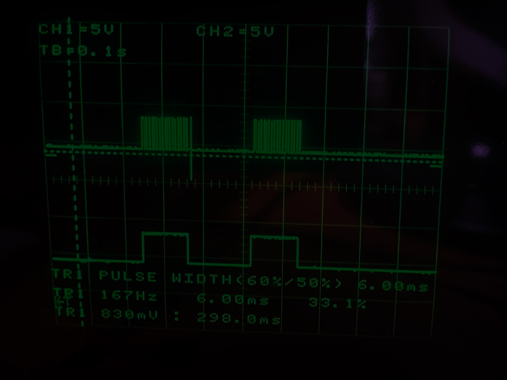
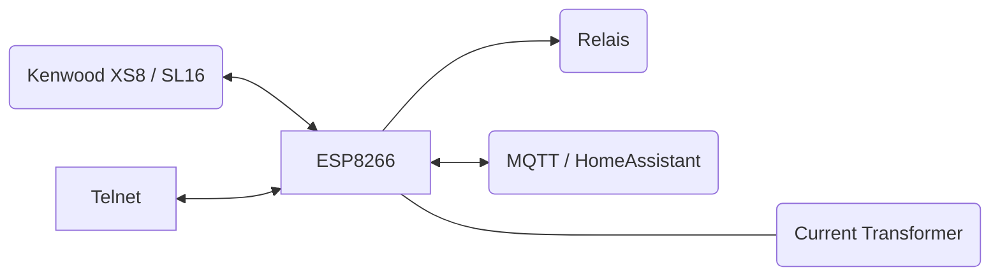
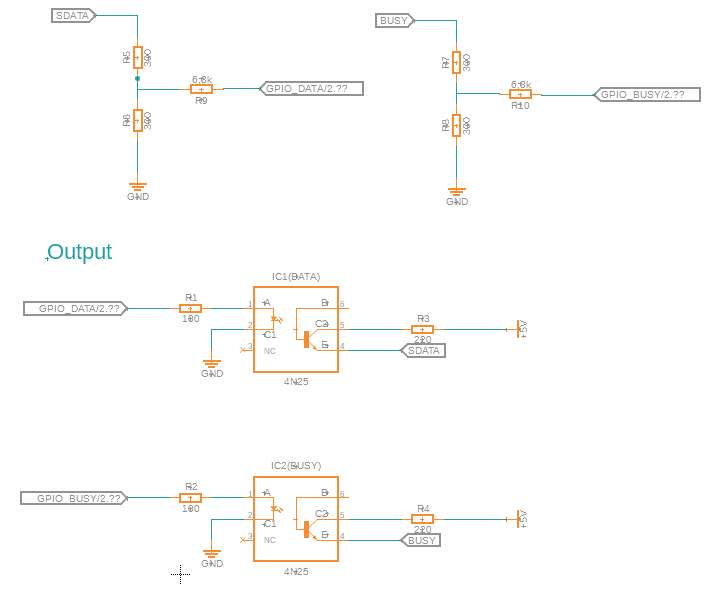

# KenwoodIOT

A simple project that works with the **XS8/SL16** bus to address Kenwood products.

In addition, a transducer is built in to switch on the amplifier when a load is switched on at the socket.

---

### Device Topology:

### Device Schematic:

### Telnet:

The Device features a Telnet Server for Debugging Serial Prints over WiFi/Ethernet.

#### Telnet Commands:

- /help
- /reset
- /clear
- /bye
- /info
- /send

---

### Setting Up:

##### First Setup:

`http://<ip-address>/config`

##### Authentification at Runtime:

Username: admin
Password: <AP-Passoword>

---

### Sensor Calibration:

Since I didn't have time to calibrate the sensor properly, I just took a 60W light bulb and used that as a reference.

The accuracy is not important in this project, because I don't use the real voltage, instead I use the static factor of
230 (V).

https://github.com/openenergymonitor/learn/blob/master/view/electricity-monitoring/ctac/emonlib-calibration-theory.md